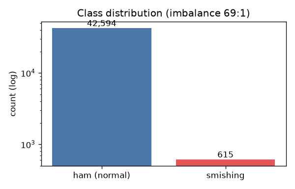
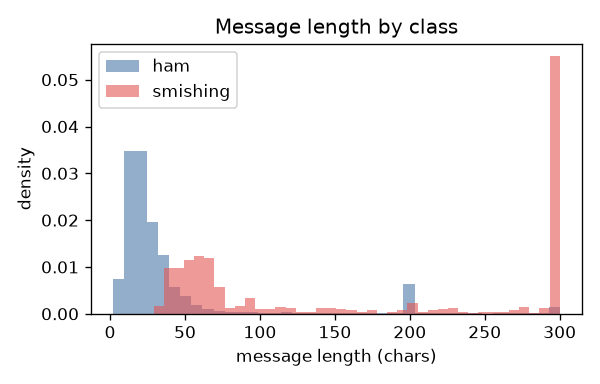
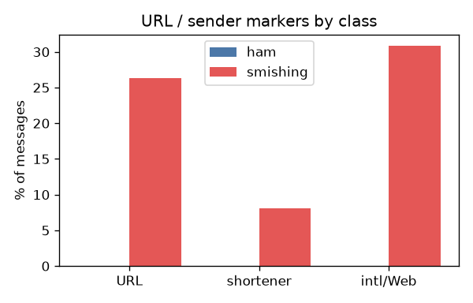

# EDA — Kor-Smishing 데이터셋

> 재현: `python -m src.eda` (코드 [src/eda.py](../src/eda.py))
> 원칙: **집계 통계·차트만 기록**. 문자 원문은 게시하지 않음(라이선스·개인정보).
> 출처: [KOR_phishing_Detect-Dataset](https://github.com/Ez-Sy01/KOR_phishing_Detect-Dataset)

---

## 1. 규모와 불균형

| 구분 | 건수 |
|------|------|
| 정상(ham) | 42,594 |
| 스미싱 | 615 |
| **합계** | 43,209 |

**클래스 불균형 69.3 : 1.** 정확도 단독 지표는 무의미(전부 정상이라 찍어도 98.6%) → 스미싱 클래스의 정밀도/재현율/F1로 평가해야 함. 학습 시 클래스 가중치 또는 균형 샘플링 필요.

- 정확 중복(content 완전일치): **141건** → 전처리에서 제거, train/test 분할 전 중복 누수 차단 필요.

## 2. 길이 분포

| 클래스 | 중앙값 | 평균 | 95pct |
|--------|--------|------|-------|
| 정상 | 22자 | 41자 | 200자 |
| 스미싱 | 125자 | 296자 | 803자 |

- **스미싱이 훨씬 길다** — 사칭 서사·안내문·링크를 담기 때문. 반면 정상은 짧은 일상 문자.
- ⚠️ **데이터 품질 이슈**: ham에 SMS 답지 않은 잡음 텍스트(게시판 댓글류)가 섞여 있음(라벨링 관찰). 아주 짧은(≤5자) 정상도 0.7% 존재. → 정상 소스를 본인 수신 문자·공개 코퍼스로 보강할 근거(계획 B3).

## 3. URL·발신 신호

| 지표 | 정상 | 스미싱 |
|------|------|--------|
| URL 포함 | ~0% | **26.3%** |
| 단축 URL | ~0% | 8.1% |
| 국외/[Web발신] | ~0% | 30.9% |

- URL·국외발신은 스미싱에 강하게 편중 → 강한 특징(feature)이자 risk_factor 태그 근거.
- **그러나 스미싱의 73.7%는 URL이 없다.** 지인 사칭 송금 요구, 회신 유도(보이스피싱 연계) 등 **URL 없는 스미싱**이 다수 → URL 규칙 기반 필터의 한계이자, 문맥을 읽는 LLM 접근의 정당성.

## 4. risk_factor 태그의 실데이터 출현율 (스미싱 기준)

키워드 근사로 [스키마_프롬프트_설계.md](스키마_프롬프트_설계.md) §1 태그의 실재 여부를 검증:

| 태그(근사) | 출현율 | 태그(근사) | 출현율 |
|-----------|--------|-----------|--------|
| impersonation_financial | 44.9% | urgency_pressure | 38.7% |
| financial_lure | 42.9% | impersonation_gov | 25.4% |
| personal_info_request | 12.4% | impersonation_delivery | 12.2% |
| fear_appeal | 8.6% | app_install_request | **1.6%** |

**해석 / 태그 체계 조정**
- 금융 사칭·금전 유인·시간 압박이 이 데이터의 주류(2018~2021 스미싱 특성).
- `app_install_request`(APK 설치 유도)가 1.6%로 매우 낮음 — 최신 스미싱에선 흔하지만 이 시기 데이터엔 드묾. 태그는 유지하되 **증강으로 보강** 필요(최신 유형 반영).
- 택배 사칭(12.2%)은 통념보다 낮음 → 증강 시 유형 균형(사칭 대상 다양화)을 명시적으로 조절.

## 5. 프로젝트에 주는 함의

1. **평가**: 불균형이 심하므로 F1·클래스별 지표 필수(정확도 금지). EXP-001 설계와 일치.
2. **증강 방향**: URL 없는 스미싱, 택배·APK 설치 유형, 최신 사칭 패턴을 우선 보강해 실분포의 편향·구식화를 상쇄.
3. **전처리**: 중복 141건 제거 + ham 잡음 필터링(길이·비문자성) + train/test 중복 누수 차단.
4. **정상 데이터 보강**: ham 품질 이슈 → 본인 수신 문자·공개 코퍼스로 경계 사례(합법 광고 등) 확충.
